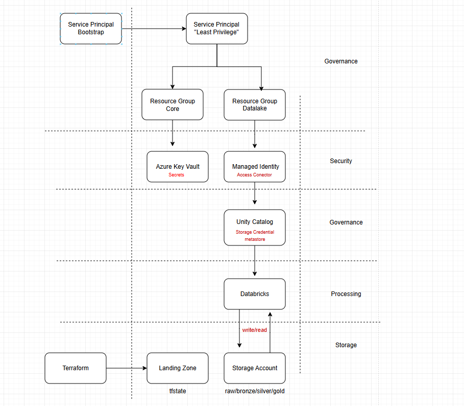
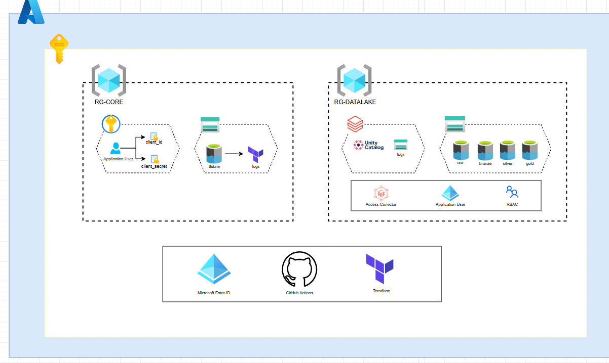

# Sunny Data (Terraform + GitHub Actions)

<p align="center">
  
</p>


O repositório "sunny-data" é um dos componentes da solução [One Data](https://github.com/ViniciusOtoni/medalforge-lakehouse-data) para o programa Data Master organizado pela F1rst Santander. Solução proposta e desenvolvida por [Vinicius Otoni](http://linkedin.com/in/vinicius-otoni-b330b3295/)

## Conteúdos do Repositório

1. [Visão Inicial](#1-visão-inicial)  
   - [Objetivo](#11-objetivo)  
   - [Visão do fluxo](#12-visão-do-fluxo)  
   - [Componentes](#13-componentes)  

2. [Arquitetura Técnica](#2-arquitetura-técnica)  

3. [Terraform](#3-terraform)  
   - [Arquitetura de Módulos](#31-arquitetura-de-módulos)  
   - [Vídeo Técnico](#32-vídeo-técnico-demostração-no-projeto)  

4. [Least Privilege](#4-least-privelege)  

5. [Microserviços](#5-microserviços)  
   - [core-identity](#51-core-identity)  
   - [landing-zone](#52-landing-zone)  
   - [storage-foundation](#53-storage-foundation)  
   - [databricks-workspace](#54-databricks-workspace)  
   - [workspace-config](#55-workspace-config)  

6. [GitHub Actions](#6-github-actions)  
   - [Vídeo Técnico](#61-vídeo-técnico-demostração-no-projeto)  

7. [Sync Databricks (IAM)](#7-sync-databricks-iam)  
   - [Funcionamento](#71-funcionamento)  
   - [Materialização de grupos e usuários](#72-materialização-de-grupos-e-usuários)  
   - [Integração com Terraform](#73-integração-com-terraform)  
   - [Grants e permissões](#74-grants-e-permissões)  

8. [Pré-requisitos (Setup)](#8-pré-requisitos-setup)  
   - [Criação da SPN Bootstrap](#81-criaçao-da-spn-bootstrap)  
   - [Atribuição da SPN dinâmica como Account Admin](#82-atribuição-da-spn-dinâmica-como-account-admin)  

9. [Melhorias Futuras](#9-melhorias-futuras)  

10. [Referências](#10-referências)

---

## 1. Visão Inicial

Sessão para esclarecimento do propósito do projeto e melhor entendimento.

### 1.1 Objetivo

Sunny-data é um componente responsável pela criação de todo o ecossistema do projeto, visando replicabilidade do projeto, segurança, automação e escalabilidade através do Terraform (IaC) em conjunto com o GitHub Actions (CI/CD)

### 1.2 Visão do fluxo

O projeto foi desenvolvido pensando em evitar manualidades e respeitando princípios de segurança. Sendo assim, foi utilizado o conceito de [Least Priveleage](#4-least-privelege) para evitar vulnerabilidades relacionadas a acessos na Azure, além de evitar manualidade com o Terraform e GitHub Actions.

<p align="left">
  
</p>

### 1.3 Componentes

Componentes/recursos criados na Azure através do Terraform para execução do fluxo.

- **Microsoft Entra ID (AD)**
É o serviço de identidade e acesso (IAM) da Microsoft, responsável por gerenciar usuários, grupos, aplicações e dispositivos em um tenant. Ele fornece autenticação e autorização para recursos do Azure e de milhares de aplicações SaaS, permitindo aplicar políticas como MFA, Conditional Access e RBAC.

    Além disso, o Entra ID é a base para criação de Service Principals e Managed Identities, que permitem que aplicações e serviços interajam com segurança sem uso de credenciais manuais.

- **Service Principal (SPN)**
É uma identidade de segurança no Microsoft Entra ID (antigo Azure AD) que representa aplicações, serviços ou automações (por exemplo, pipelines de CI/CD) ao acessar recursos do Azure sem usar contas de usuário. O SPN é usado para autenticação e para receber autorizações de acesso seguindo o princípio do menor privilégio, com permissões atribuídas via RBAC no escopo adequado (grupo de gerenciamento, assinatura, resource group ou recurso).

    Em alguns serviços há suporte a ABAC (controles baseados em atributos/condições), complementando o RBAC. As credenciais de um SPN podem ser segredo, certificado ou federação de credenciais (ex.: OIDC com GitHub Actions), favorecendo automação com rastreamento e auditoria adequados nas operações.

- **Resource Group (RG)**
É um contêiner lógico no Azure que agrupa recursos relacionados dentro de um mesmo escopo de gerenciamento. Ele facilita a organização, atribuição de permissões (RBAC) e a aplicação de políticas (como Azure Policy).

- **Storage Account (SA)**
É um serviço fundamental do Azure que fornece diferentes tipos de armazenamento na nuvem: (Blob Storage, Table Storage entre outros...) O acesso é controlado por Azure RBAC, permitindo conceder permissões a identidades gerenciadas, usuários ou service principals para operações como leitura, gravação ou exclusão.

    Na arquitetura de dados, utiliza-se o Azure Data Lake Storage Gen2 (ADLS Gen2), que habilita o namespace hierárquico (HNS), permitindo organização em diretórios/pastas e integração nativa com External Locations do Databricks Unity Catalog.

- **Azure Key Vault (KV)**
É um serviço do Azure usado para armazenar e proteger informações sensíveis (como senhas, strings de conexão, chaves de criptografia e certificados). Ele garante que esses valores fiquem centralizados, criptografados e acessíveis somente a identidades autorizadas, reduzindo riscos de exposição.
    
    - **Secrets**
    São um dos componentes do KV, usados para armazenar informações sensíveis como senhas, tokens, strings de conexão e chaves de API. Cada vez que o valor de um Secret é atualizado, o serviço cria automaticamente uma nova versão, permitindo rastreabilidade e controle de rotação. O acesso aos Secrets é restrito a identidades (usuários, grupos ou aplicações) que tenham a função adequada (RBAC ou access policy) atribuída no Key Vault.

- **Databricks**
É uma plataforma unificada de dados que centraliza todo o ciclo de vida do dado em um único ambiente, permitindo desde a ingestão e processamento até a análise avançada e criação de modelos de machine learning. Com recursos como Workflows, Jobs e Delta Live Tables, é possível aplicar a Medallion Architecture (Bronze, Silver e Gold) sobre o Delta Lake, garantindo qualidade e consistência no tratamento dos dados. A plataforma também oferece ferramentas para o desenvolvimento, rastreamento e publicação de modelos com MLflow e disponibilização em Serving Endpoints, além de permitir exploração e visualização dos dados por meio do Databricks SQL Editor e Dashboards. Complementando tudo isso, o Unity Catalog assegura governança unificada, com gerenciamento centralizado de metadados, controle de permissões, auditoria e lineage em toda a plataforma.

    - **Unity Catalog (UC)**
        É o sistema de governança de dados do Databricks, fornecido em nível de conta, que centraliza a gestão de metadados, permissões de acesso e auditoria de forma unificada em todas as workspaces. Ele permite controlar quem pode acessar ou modificar catálogos, schemas, tabelas, views, volumes e outros objetos de dados, aplicando o princípio do menor privilégio. Além disso, funciona como um catálogo central de descoberta, permitindo identificar, classificar e rastrear dados, com suporte a lineage e monitoramento de uso em toda a plataforma.

        - **Metastore**
        É a instância central do UC, responsável por armazenar e gerenciar os metadados, permissões e lineage de dados. Todas as workspaces associadas a um mesmo Metastore compartilham os mesmos catálogos, schemas e tabelas, garantindo governança unificada. O Metastore é definido por região no Azure, e pode ser vinculado a múltiplas workspaces dentro dessa mesma região.

        - **Storage Credential**
        É um objeto do UC (account-level) que define como o Databricks acessa sistemas de armazenamento externos, como um Azure Storage Account. Ele pode utilizar diferentes formas de autenticação — tipicamente uma Managed Identity vinculada a um Access Connector, mas também pode ser configurado com Service Principals ou outras credenciais.
        
            A partir desse credential, o Databricks pode ler e gravar dados no Storage de forma segura, sempre aplicando as permissões e a governança definidas no Unity Catalog.

- **Managed Identity (Access Conector)**
É um recurso do Azure que fornece uma identidade gerenciada (Managed Identity) usada pelo Azure Databricks para autenticar-se no Storage Account, sem necessidade de segredos ou chaves de acesso (Keys do Storage Account). Essa identidade recebe as roles mínimas necessárias (como Storage Blob Data Contributor) no Storage Account, garantindo que apenas ela possa realizar as operações de leitura e escrita.

    No contexto do Unity Catalog, o Access Connector é associado a um Storage Credential, permitindo que o Databricks acesse os dados do Storage e aplique controles de segurança e governança em nível lógico (tabelas, esquemas, catálogos).

## 2. Arquitetura Técnica

A arquitetura técnica é baseada em uma infraestrutura provisionada via Terraform, gerênciada pelo Microsoft Entra ID e automatizado com Pipelines automatizados via GitHub Actions. 

O processo será dividido em dois contextos:

 - **RG-CORE**
    Gerênciado principalmente pela SPN bootstrap, seguindo os princípios de [Least Priveleage](#4-least-privelege). Responsável por criar a SPN dinâmica, armazenar as suas respectivas secrets no Key Vault além de criar um Storage Account para repousar os *tfstate* gerados pelo Terraform durante o processo de CI/CD.

 - **RG-DATALAKE**
    Gerenciado pela SPN dinâmica, é responsável por provisionar todo o ecossistema do Data Lake. Isso inclui a criação do Storage Account, onde os dados são armazenados em suas diferentes camadas/estágios, e a criação do Databricks, que executa o ciclo de vida do dado. Além disso, garante a conectividade segura entre o Databricks e o Storage, assegurando governança e automação do fluxo de dados.

<p align="left">
  
</p>

---

## 3. Terraform 

É uma ferramenta de IaC (Infrastructure as Code) utilizada para provisionar e gerenciar recursos de acordo com o provider escolhido.

Neste projeto, a implementação segue a arquitetura de módulos, que organiza o código em componentes reutilizáveis e independentes.


### 3.1 Arquitetura de Módulos

- **main.tf** → definição dos resources que compõem aquele módulo.

- **outputs.tf** → valores de saída que podem ser consumidos por outros módulos ou microserviços.

- **providers.tf** → declaração dos provedores utilizados (ex.: AzureRM, AzureAD, Databricks).

- **variables.tf** → definição de variáveis para parametrizar o módulo.

- **backend.tf** → configuração do local onde será armazenado o tfstate (estado da infraestrutura).

#### Vantagens dessa divisão

- **Reutilização**: o mesmo módulo pode ser chamado em diferentes microserviços ou ambientes (ex.: criar múltiplos RGs ou Key Vaults com padrões iguais).

- **Manutenção facilitada**: cada módulo concentra apenas a lógica do recurso, deixando o código mais simples e organizado.

- **Escalabilidade**: novos recursos podem ser adicionados criando ou estendendo módulos sem impactar o restante da infraestrutura.

- **Padronização**: garante que todos os recursos sigam uma mesma estrutura e boas práticas (naming, tags, RBAC etc.).

- **Segurança e governança**: a separação por módulos permite aplicar o princípio do menor privilégio no pipeline, já que cada microserviço só chama os módulos que precisa.

Na prática, os microserviços (pastas ou repositórios separados) são responsáveis por consumir os módulos criados, compondo a infraestrutura final de maneira modular e reutilizável, ao invés de concentrar toda a lógica em um único monólito de Terraform.


### 3.2 Vídeo Técnico (Demostração no Projeto!)

<video width="100%" height="300px" controls>
  <source src="./assets/videos/demo.mp4" type="video/mp4">
</video>

---

## 4. Least Privelege
O princípio de Least Privilege (Privilégio Mínimo) busca aumentar a segurança ao conceder apenas as permissões estritamente necessárias para cada ação, evitando atribuição de roles excessivamente permissivas.

No contexto do Azure, aplica-se criando uma SPN bootstrap (gerada manualmente via CLI) com permissões iniciais elevadas — por exemplo, Contributor e User Access Administrator na subscription — cujo único objetivo é criar uma SPN dinâmica.

A SPN dinâmica, por sua vez, recebe apenas as permissões necessárias para operar: tipicamente Reader na subscription (visibilidade), Contributor nos Resource Groups (criação de recursos) e, se necessário, User Access Administrator apenas no escopo específico.

Dessa forma, evita-se o uso de roles altamente permissivas como Owner, garantindo um modelo de segurança baseada em menor privilégio e reduzindo a superfície de risco.

Como a SPN dinâmica é responsável pela criação da Workspace Databricks, é necessário que ela receba a permissão de Account Admin para criar e gerenciar recursos no escopo de conta, como Unity Catalog Metastore, Storage Credentials, External Locations e Catálogos.
Esse privilégio, porém, deve ser concedido apenas para viabilizar o provisionamento automatizado e pode ser removido ou restringido após a configuração inicial, de forma a manter o princípio do Least Privilege.

---

## 5. Microserviços

Foi adotada a abordagem de microserviços para dividir os processos de provisionamento em etapas independentes, evitando a forte dependência característica de um fluxo monolítico. Essa segregação aumenta a manutenibilidade (cada microserviço pode ser ajustado sem impacto no restante da infraestrutura) e a escalabilidade (novos recursos ou camadas podem ser adicionados de forma modular e incremental).

Dessa forma, é possível executar de forma encadeada os microserviços via CI/CD além de garantir melhor governança para os mesmos.  

### 5.1 core-identity
Este microserviço é responsável pela criação de todos os recursos core do ecossistema. Ele provisiona dois Resource Groups principais (rg-medalforge-core e rg-medalforge-datalake), cria a SPN dinâmica seguindo o princípio de [Least Priveleage](#4-least-privelege) e realiza a atribuição das roles necessárias nesses Resource Groups.

Além disso, provisiona um Key Vault para armazenar, de forma segura, o *CLIENT_ID* e o *CLIENT_SECRET* da SPN dinâmica como secrets. Por fim, também cria grupos no Microsoft Entra ID, adicionando a SPN dinâmica como membro, garantindo que ela esteja incluída nas políticas de identidade e governança do ambiente.

Dessa forma, é eliminado a necessidade de expor as credenciais da SPN dinâmica no Pipeline além de facilitar o gerenciamento de permissões segregadas por grupos.

### 5.2 landing-zone
Este microserviço é responsável pela criação de um *Storage Account* e de um *Container* dedicados ao armazenamento do tfstate de todos os microserviços, definido no arquivo backend.tf. Essa configuração garante que o estado da infraestrutura fique centralizado, persistente e seguro, permitindo consistência entre diferentes execuções do Terraform e facilitando a automação via pipelines.

### 5.3 storage-foundation
Este microserviço é responsável pela criação de dois Storage Accounts *medalforgedatabricks* e *medalforgestorage*  juntamente com seus respectivos containers.

O Storage Account medalforgedatabricks é configurado como Storage Root no momento da criação do Metastore do Unity Catalog, garantindo que todas as Managed Tables tenham seus dados armazenados de forma centralizada e governada.

Já o Storage Account medalforgestorage é destinado ao Data Lake, estruturado segundo a Medallion Architecture (raw → bronze → silver → gold), sendo o local onde os dados brutos são ingeridos e evoluem através das camadas de transformação até atingir os modelos analíticos finais.

Por fim, este microserviço também provisiona o Managed Identity (Access Connector), que será utilizado pelo Databricks para autenticar-se com segurança nos Storage Accounts, eliminando a necessidade de chaves de acesso. [Definição do Access Conector](#13-componentes)

### 5.4 databricks-workspace
Este microserviço é responsável por provisionar a Workspace do Databricks utilizando a SPN dinâmica, garantindo que a criação seja totalmente automatizada via IaC. Durante o provisionamento, a workspace já é configurada para utilizar o Managed Identity (Access Connector), permitindo futuras integrações seguras com o Unity Catalog, como a criação de Storage Credentials e External Locations.

A workspace é criada com o SKU Premium, requisito fundamental para habilitar os recursos de governança e segurança unificada do Unity Catalog.

### 5.5 workspace-config
Este microserviço é responsável pela configuração inicial da governança no Databricks. Ele cria o Metastore do Unity Catalog, realiza a associação (attach) desse Metastore à Workspace provisionada anteriormente e faz a propagação dos grupos em nível de conta (account level), em conjunto com o [IAM](#7-sync-databricks-iam).

Também é responsável por criar o Storage Credential (utilizando o Managed Identity configurado no storage foundation), provisionar os External Locations que referenciam os Storage Accounts e estruturar os Catálogos. Por fim, aplica os GRANTs de permissões nesses catálogos e schemas, garantindo que os acessos sigam o princípio de Least Privilege.

---

## 6. GitHub Actions

É uma tecnologia de CI/CD (*Continuous Integration* & *Continuous Delivery*) utilizada para automatizar o deploy de aplicações, provisionamento de infraestrutura e validações de integridade do código.

Cada workflow é composto por um ou mais jobs, e cada job contém uma sequência de steps (actions) a serem executados. Além disso, o GitHub Actions permite definir dependências entre jobs e workflows, possibilitando a orquestração em DAG: um job (ou workflow) só é iniciado após a conclusão e verificação do status do anterior.

Essa abordagem possibilita construir pipelines de automação robustos, onde múltiplos repositórios podem ser acionados de forma encadeada, garantindo controle sobre a ordem de execução e integração contínua de todo o ecossistema.

Finalizando, o GitHub Actions possui uma ótima conectividade com a Azure através da action @azure/login@v2

### 6.1 Vídeo Técnico (Demostração no Projeto!)

<video width="100%" height="300px" controls>
  <source src="./assets/videos/demo.mp4" type="video/mp4">
</video>

---

## 7. Sync Databricks (IAM)

O Automatic Identity Management é uma feature que está em **Public Preview** do Databricks que permite sincronizar identidades do Microsoft Entra ID (Azure AD) diretamente com o Unity Catalog, garantindo que usuários e grupos corporativos sejam materializados automaticamente dentro da conta Databricks. Dessa forma, o gerenciamento de acesso é centralizado no Entra ID, eliminando a necessidade de criar ou manter identidades manualmente dentro do Databricks.

### 7.1 Funcionamento

- Usuários e grupos do Entra ID são provisionados automaticamente no Databricks assim que recebem permissões ou são adicionados a grupos vinculados à plataforma.

- Cada identidade ganha um external_id, que corresponde ao identificador do objeto no Entra ID (Object ID).

- O Databricks armazena essas identidades no nível account e elas podem ser referenciadas em workspaces e no Unity Catalog para aplicar permissões.

### 7.2 Materialização de grupos e usuários

Quando um grupo é criado no Entra ID e adicionado como membro de um workspace ou metastore, ele é materializado automaticamente no Databricks.

A sincronização garante consistência entre ambientes: se um usuário é removido ou perde associação no Entra ID, a identidade no Databricks também é ajustada.

### 7.3 Integração com Terraform

No Terraform, a referência a usuários e grupos do Entra ID no Databricks é feita utilizando o atributo external_id, que corresponde ao Object ID do recurso no Entra ID. Exemplos:

````terraform
data.databricks_group # para buscar grupos já sincronizados.

data.databricks_service_principal # para resolver SPNs previamente criadas.
````

Esse mapeamento garante que não seja necessário criar manualmente as identidades no Databricks: o Terraform apenas as consome via external_id, aplicando grants diretamente sobre grupos ou SPNs já existentes no Entra ID.

### 7.4 Grants e permissões

Com as identidades materializadas, o Terraform aplica os GRANTs de acesso no Unity Catalog, atribuindo permissões em diferentes níveis:

- **Metastore** → atribuição de privilégios globais (ex.: CREATE_CATALOG).

- **Catálogo** → permissões de criação e acesso a schemas.

- **Schema** → privilégios de criação de tabelas, views e funções.

- **Tabela/Volume** → permissões de leitura, escrita ou gerenciamento específico.

Esse modelo garante que toda a governança de dados seja integrada ao IAM corporativo, mantendo rastreabilidade e aderência ao princípio de [Least Privilege](#4-least-privelege).

---

## 8. Pré-requisitos (Setup)

- Conta na Azure
- Subscrição na Azure
- Realizar o az login

### 8.1 Criaçao da SPN Bootstrap:

````bash
az ad sp create-for-rbac --name "terraform-admin-spn-user" --role="Contributor" --scopes="/subscriptions/<subscriptionID>"
````

Será retornado o *PASSWORD*, *TENANT* e *APPID* após a criação. Esses valores, precisam ser cadastrados nas Secrets do repositório GitHub.

- **ARM_CLIENT_SECRET** -> *PASSWORD*
- **ARM_TENANT_ID** -> *TENANT*
- **ARM_CLIENT_ID** -> *APPID*
- **ARM_SUBSCRIPTION_ID** -> *subscriptionID*

<video width="40%" height="300px" controls>
  <source src="./assets/videos/adicionar-secret.mp4" type="video/mp4">
</video>

- Recupere o *OBJECT_ID* para gravar na secret **ARM_OBJECT_ID**

````bash
az ad sp show --id <appId> --query id -o tsv  
````

- Cadastre os valores seguindo esse formato em JSON na secret **AZURE_CREDENTIALS**

````json
{
  "clientId": <appId>,
  "clientSecret": <password>,
  "tenantId":   <tenant>,
  "subscriptionId": <subscriptionId>
}
````

- Atribua a role de *User Access Administrator* para a SPN

````bash
az role assignment create \
    --assignee-object-id <SPN_OBJECT_ID> \
    --role "User Access Administrator" \
    --scope "/subscriptions/<subscriptionId>"
````

- Atribuir a SPN como Cloud Application Administrator

<video width="40%" height="300px" controls>
  <source src="./assets/videos/cloud-application.mp4" type="video/mp4">
</video>

- Adicione essas duas roles no Microsoft Graph *Directory.ReadWrite.All* e *Group.ReadWrite.All*

<video width="40%" height="300px" controls>
  <source src="./assets/videos/MicrosoftGraph.mp4" type="video/mp4">
</video>

### 8.2 Atribuição da SPN dinâmica como Account Admin

> Essa etapa deve ser realizada apenas quando o workflow databricks-workspace exigir validação no JOB **🚦 Aguardar grant account_admin**

- Entre no console de account do Databricks (https://accounts.azuredatabricks.net/)
    Para logar, informe o seu e-mail **UPN** recuperado no Microsoft Entra ID

<video width="40%" height="300px" controls>
  <source src="./assets/videos/UPN.mp4" type="video/mp4">
</video>

- Atribua a SPN dinâmica como Account Admin

<video width="40%" height="300px" controls>
  <source src="./assets/videos/accountAdmin.mp4" type="video/mp4">
</video>


- Delete o metastore criado por Default

<video width="40%" height="300px" controls>
  <source src="./assets/videos/metastore.mp4" type="video/mp4">
</video>

- Recupere o valor do Account ID e grave na secret do GitHub **ARM_ACCOUNT_ID**

<video width="40%" height="300px" controls>
  <source src="./assets/videos/accountID.mp4" type="video/mp4">
</video>

- Aprovar JOB para finalização do Workflow

<video width="40%" height="300px" controls>
  <source src="./assets/videos/approvement.mp4" type="video/mp4">
</video>

---

## 9. Melhorias Futuras

Abaixo estão listadas algumas melhorias que podem ser incorporadas ao projeto. É importante destacar que o processo atual é um protótipo desenvolvido no contexto do programa Data Master, organizado pela F1rst Santander.

- **Implementação de VNet Injection**
Na etapa de criação da Workspace, é possível anexar uma Virtual Network (VNet) gerenciada, de forma que todo o *Data Plane* seja processado dentro da rede configurada. Isso adiciona uma camada extra de segurança, garantindo maior controle sobre o tráfego de dados.

> ⚠️ Observação: nesse cenário, será necessário manter o Network Watcher habilitado para garantir monitoramento adequado da rede.

- **Criação de Tags para Segregação de Custos**
A aplicação de tags padronizadas em todos os recursos permite melhorar a visibilidade e rastreabilidade dos custos, além de facilitar a governança e a alocação de despesas por equipe, ambiente ou projeto.

- **Segregação de Ambientes**
A estrutura pode ser expandida para contemplar ambientes como Desenvolvimento, Homologação e Produção, cada um com suas próprias restrições e políticas de segurança. Em especial, o ambiente de Produção deve possuir controles mais rígidos, garantindo maior resiliência, isolamento e auditoria.

- **Implementação de Lifecycle Management nos Storage Accounts**
Nos Storage Accounts, podem ser configuradas políticas de Lifecycle Management, que automatizam a movimentação e expiração de dados entre camadas de armazenamento. Isso otimiza custos e garante que dados menos acessados sejam transferidos para camadas mais baratas, mantendo os dados críticos em camadas de maior performance.

---

## 10. Referências

- [Terraform Docs](https://registry.terraform.io/providers/hashicorp/azurerm/latest/docs)
- [GitHub Actions Docs](https://docs.github.com/pt/actions)
- [Sync Databricks](https://learn.microsoft.com/en-us/azure/databricks/admin/users-groups/scim/)
- [Least Privilege](https://learn.microsoft.com/en-us/entra/identity-platform/secure-least-privileged-access)